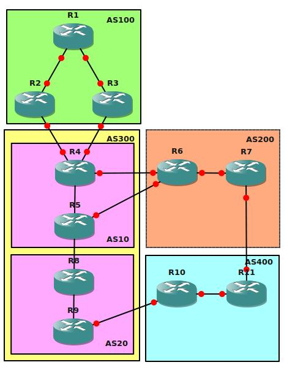

# BGP Advanced

## Scenario:

You have been working for a service provider called "FreedomBits" for quite some time and you have been responsible for the operation of all IGP's. Your BGP expert/colleague has won the X-factor competition and decided to start a singing career...it's up to you to upgrade your skills and become the new BGP guru in town. You have heard alot about BGP and even did some basic configurations but never tried anything with confederations or route-reflectors...time for a change!

## Goal:

All IP addresses have been preconfigured for you in the following order:

- R1 - R2: 192.168.12.X
- R1 - R3: 192.168.13.X
- R3 - R4: 192.168.34.X

(Where X = Router number)

And so on...

Every router has a Loopback0 interface:
X.X.X.X

(Where X = Router number)

### Configuration Requirements:

- Configure each Autonomous System (AS) with a different IGP:
  - AS100: RIP
  - AS300: OSPF
  - AS200: EIGRP
  - AS400: OSPF

- Do not configure the IGP on the interfaces connecting to another AS. For example; R3 should not send any RIP routing updates towards R4.

- Make sure the loopbacks are advertised in the IGP's.

- Configure BGP on every router, make sure you have the right IBGP and EBGP configurations. AS300 has to be configured as a confederation.

- R1 has to be configured as a route-reflector for R2 and R3.

- Configure on all routers that BGP updates are sourced from the Loopback0 interface.

- Configure BGP authentication between R7 and R11, use password VAULT

- Make sure all BGP neighbor relationships are working before you continue with the next steps.

- Advertise all physical and loopback interfaces in BGP, you are not allowed to use the "network" command to achieve this.

- Achieve full connectivity, every IP address should be pingable. Use a TCLSH script to do this.

- When R4 sends a ping to the loopback interface of R1 it should choose the path through R2. You are only allowed to make changes on R3.

- Create another loopback interface on R1 with ip address 172.16.1.1 /24, advertise this in RIP.

- When R4 sends a ping to the 172.16.1.1 address it should take the path through R3, you are only allowed to make changes on R4.

- When R6 sends a ping towards the loopback interface on R11 it should go through AS300.

- R7 should prefer the path through R11 for all external networks except for 172.16.1.1.

- Configure AS300 so it is no longer a transit AS for AS200 to reach 172.16.1.1 in AS100. AS400 should not be influenced.

## IOS:

- c3640-jk9s-mz.124-16.bin

## Topology:

## Video Solution:

http://www.youtube.com/watch?v=FtD8W3Q97HI
