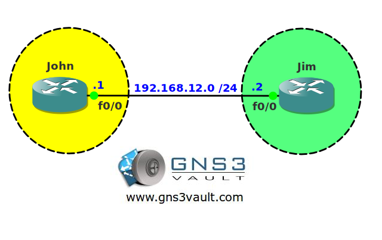

# BGP Aggregation Unsuppress Map

## Scenario

John and Jim are setting up their own ISP and start by configuring BGP between their routers. Because they want to make sure not to advertise too many prefixes they want to configure BGP aggregation. It's up to you to make it happen.

## Goal

* All IP addresses have been preconfigured for you.
* Configure EBGP between router John and Jim. Pick whatever AS you like.
* Advertise all loopback interfaces on router Jim in BGP.
* Create a summary for the loopback interfaces on router Jim. Ensure you don't have any overlapping address space.
* Ensure you only see the summary on router John with the exception of network 172.16.2.0 /24.

## IOS

`c3640-jk9s-mz.124-16.bin`

## Topology

## Video Solution

[BGP Aggregation Unsuppress Map Video](http://www.youtube.com/watch?v=v4eHtre_hd4)
