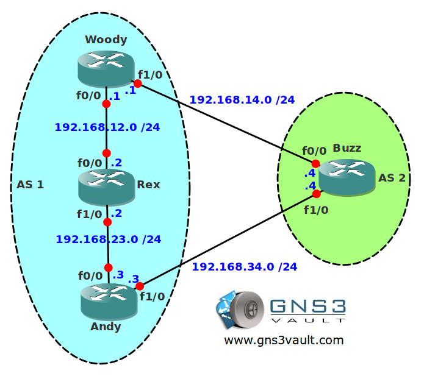

# BGP Allow AS In

## Scenario

An international toy store company needs your help. They use BGP to exchange routing information between their sites but everytime one of their IBGP routers fails they have connectivity issues. Let's see if you can help them out!

## Goal

* All IP addresses have been preconfigured for you.
* Configure IBGP within AS 1, source BGP updates from the loopback0 interfaces.
* Configure EBGP between router Woody and Buzz.
* Configure EBGP between router Andy and Buzz.
* Advertise the loopback1 interfaces in BGP on router Woody and Andy.
* Ensure router Woody and Andy can still reach each others loopback interfaces when router Rex fails.

## Additional Information

## IOS

* c3640-jk9s-mz.124-16.bin

## Topology

## Video Solution

* [Video Solution on YouTube](http://www.youtube.com/watch?v=Ec07c8Qz1CU)
