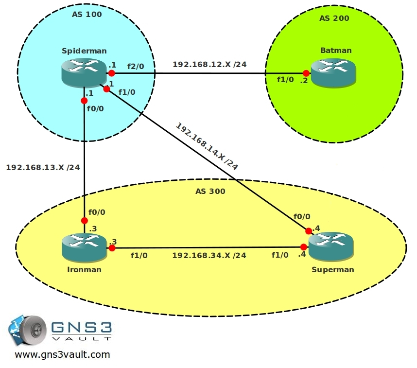

# BGP Always compare MED

## Scenario

You are the senior networking engineer working for a huge comic book provider. Your network (AS 100) is connected to 2 different service providers and normally all traffic is being sent to your main ISP which is AS 300. However there is a certain network that is being sent to AS 200 which is your backup ISP. All traffic should be sent towards AS300, is this a cheap trick from your backup ISP to make more money? Or is there something else going on? Time for justice!

## Goal

* All IP addresses are preconfigured as specified in the topology picture.
* Configure EBGP between AS 100 and AS 200.
* Configure EBGP between AS 100 and AS 300, make sure you have a neighbor relationship between router Spiderman and Superman as well as between router Spiderman and Ironman.
* Configure IBGP within AS 300.
* Make sure all neighbor relationships are working, advertise the correct networks in BGP to achieve full connectivity.
* Router Batman AND Superman have the same IP address on the loopback1 interface, advertise this in BGP on both routers.
* Ensure you can ping the 1.2.3.4 address from router Spiderman.
* Take a look at the BGP table with `show ip bgp` on router Spiderman.
* Which path is being used for the 1.2.3.4 network?
* Configure router Ironman and Superman so they send a MED of 50 for the 1.2.3.4 network towards router Spiderman.
* Configure router Batman so it sends a MED of 150 for the 1.2.3.4 network towards router Spiderman.
* Check router Spiderman with `show ip bgp` to see the changes you just made, if not do a `clear ip bgp *`
* Even though the MED from AS 300 is better, why is traffic towards 1.2.3.4 still being sent towards AS 200?
* Configure router Spiderman so traffic towards 1.2.3.4 is sent towards AS 300, the only attribute you are allowed to change is MED.

## IOS

c3640-jk9s-mz.124-16.bin

## Topology

## Video Solution

http://www.youtube.com/watch?v=W07g1ktHGl4
