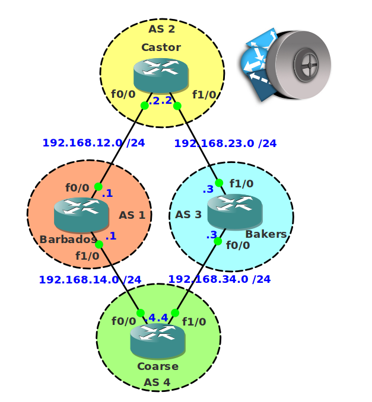

# BGP AS Path Access List

## Scenario

Sugar Cane company is an international company that is growing at a rapid rate. To connect all the different sites, BGP is used. The security officer, however, doesn't want all the sites to have full connectivity and wants you to create some filters based on AS paths.

## Goal

* All IP addresses have been preconfigured for you.
* Configure EBGP between all routers.
* You are only allowed to use AS Path Access-Lists to complete the following tasks.
* Advertise the loopback0 and loopback1 interface on all routers in BGP.
* Ensure AS1 does not become a transit AS.
* Configure router Bakers so it doesn't advertise any prefixes from AS 2 towards AS 4.
* Configure AS4 so it doesn't accept any prefixes originated by AS 1.

## About This Lab

## IOS

* c3640-jk9s-mz.124-16.bin

## Topology

