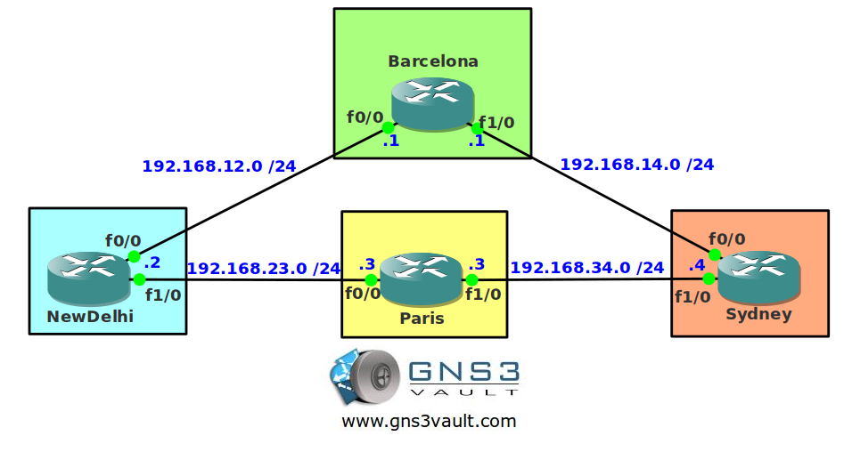

# BGP Attribute AS Path Ignore

## Scenario

You are responsible for an International network. All routers are connected through BGP. One of the network administrators in NewDelhi has configured AS Path prepending for their AS so Paris will send all traffic through Sydney. You heard about a hidden option to ignore AS Path information, maybe this is just what you need...

## Goal

- All IP addresses have been preconfigured for you as specified in the topology picture.
- Configure EBGP between all the ASes.
- Advertise the loopback0 interface on router Barcelona in BGP.
- Router Paris should have two paths to reach network 1.1.1.0/24.
- Configure AS Path prepending on router NewDelhi so router Paris sends all traffic to network 1.1.1.0/24 through router Sydney.
- Configure router Paris to ignore the added ASes so it will send traffic for network 1.1.1.0/24 to router NewDelhi. Don't use any of the other BGP attributes.

## Background

## IOS Image

- c3640-jk9o3s-mz.124-16.bin

## Topology

