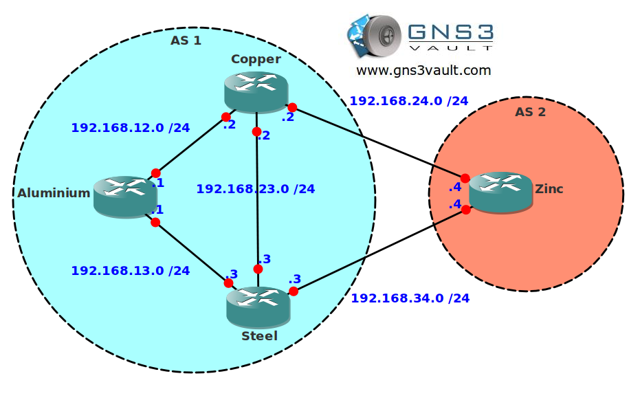

# BGP Attribute AS Path

## Scenario

A local steelmill has asked you to help them with their BGP network. The steelmill has two sites and routing information is used by using BGP. Everything is working fine except the backup link is being used for all traffic at this moment. Can you influence BGP so the traffic path is changed? Are you as tough as steel?

## Goal

- All IP addresses have been preconfigured for you as specified in the topology picture.
- Configure EBGP between router Copper and Zinc.
- Configure EBGP between router Steel and Zinc.
- Configure IBGP in AS 1.
- Advertise the 4.4.4.0 /24 network on router Zinc.
- Make sure router Aluminium sends traffic to 4.4.4.0 /24 to router Steel, you are only allowed to use the AS Path attribute.

## IOS

c3640-jk9o3s-mz.124-16.bin

## Topology

## Video Solution

[Video Solution on YouTube](http://www.youtube.com/watch?v=DF7gjBvToPs)
