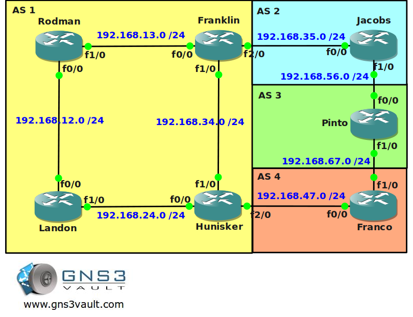

# BGP Attribute Local Preference

## Scenario

You work as a network engineer for a laboratory in San Francisco which is specialized in genetic engineering. To exchange research information with other laboratories and universities you have built a network using BGP. At this moment you have not configured any path selection for BGP and you want to make sure you have a little more control to influence your routing. Local preference is one of the BGP attributes that you are going to use to fix this.

## Goal

- All IP addresses have been preconfigured for you as specified in the topology picture.
- Configure IBGP within AS 1.
- Configure EBGP between router Franklin and Jacobs.
- Configure EBGP between router Jacobs and Pinto.
- Configure EBGP between router Pinto and Franco.
- Configure EBGP between router Hunisker and Franco.
- Advertise all networks from AS1, AS2, AS3 and AS4 in BGP.
- Ensure AS1 can reach any network in AS2, AS3 or AS4.
- You are only allowed to use the local preference attribute for the upcoming tasks.
- Configure router Franklin so all networks learned through EBGP have a local preference of 500.
- Configure router Hunisker so network 6.6.6.0/24 has a local preference of 600.
- Configure router Hunisker so all networks from AS 4 have a local preference of 700.
- Configure router Hunisker so network 66.66.66.0/24 has a local preference of 800, you are not allowed to use an access-list.

## IOS

c3640-jk9o3s-mz.124-16.bin

## Topology

## Video Solution

http://www.youtube.com/watch?v=sR27p8dpeGI
