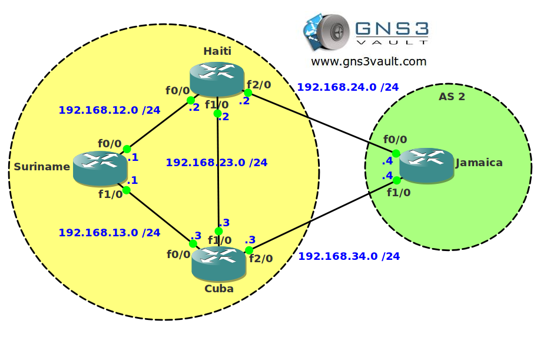

# BGP Attribute MED

## Scenario

The biggest ISP in the carribean needs your help with BGP. One of the junior BGP network engineers configured some new sites but has trouble influencing traffic patterns. Show him how to configure BGP MED and you'll have the day off to enjoy the beach and some nice sunshine.

## Goal

- All IP addresses have been preconfigured for you as specified in the topology picture.
- Configure IBGP in AS 1.
- Configure EBGP between AS1 and AS 2.
- Advertise the 4.4.4.0 /24 network on router Jamaica.
- Ensure AS 1 will use the link between Cuba and Jamaica for traffic towards network 4.4.4.0 /24. You are only allowed to use the MED (metric) BGP attribute for this.

---

## IOS

- **Image:** c3640-jk9o3s-mz.124-16.bin

## Topology

## Video Solution

- [YouTube: BGP Attribute MED Configuration](http://www.youtube.com/watch?v=04kXmcJy9TQ)
