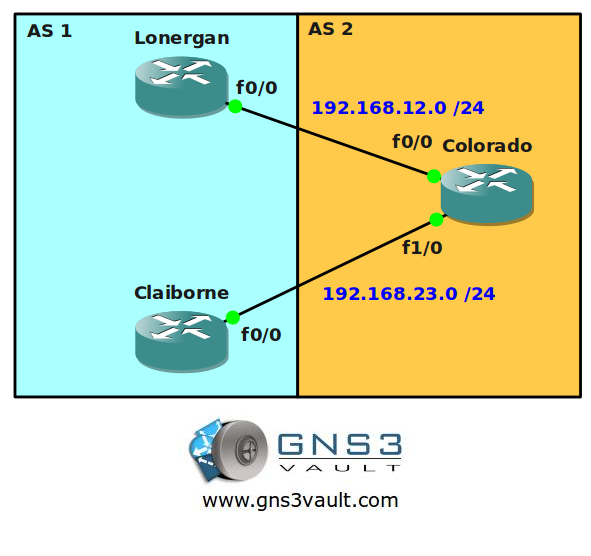

## Scenario

You are a gunslinger living in Arizona and also a network engineer for the town network. To make sure your town has connectivity with other towns you have configured the town router with BGP. Another town is using AS 1 and they are advertising a network to you. Unfortunately they have misconfigured their network so you are sending traffic to the wrong router. Your own router is an old model from 1873 and doesn't allow many changes...let's see if you can configure AS 1 to solve your problem.

## Goal

* All IP addresses have been preconfigured for you as specified in the topology picture.
* Configure EBGP between router Lonergan and Colorado.
* Configure EBGP between router Claiborne and Colorado.
* Advertise the 13.13.13.0 /24 network on router Lonergan and Claiborne.
* Make sure router Colorado sends traffic to 13.13.13.0 /24 to router Claiborne, you are only allowed to use the origin attribute.

## IOS

c3640-jk9o3s-mz.124-16.bin

## Topology

## Video Solution

[BGP Attribute Origin Video Solution](http://www.youtube.com/watch?v=0n65ou1CASI)
