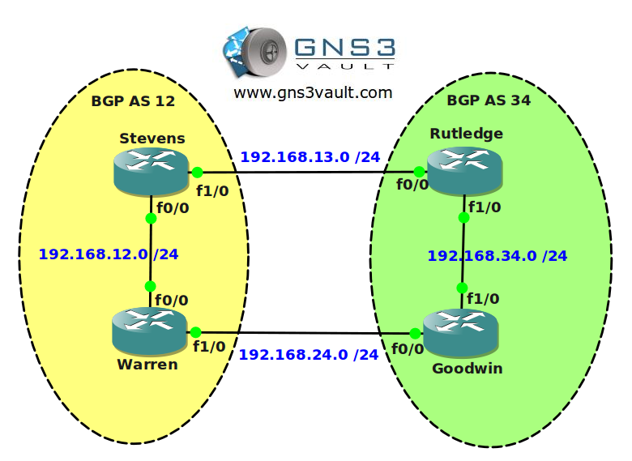

# BGP Attribute Weight

## Scenario

You wake up in what seems to be a server room...trapped in a chair and tied up by what seems to be networking cabling. In front of you is a LED screen showing you a lady in uniform. There are some problems with the BGP network and she asks you urgently if you can fix the problems. The network is running BGP but there is no load sharing at all. You need to configure AS12 and AS 34 by using the weight attribute to manipulate traffic patterns. You get 8 minutes before the network is overloaded and crashes...

## Goal

- All IP addresses have been preconfigured for you as specified in the topology picture.
- Configure IBGP within AS12 and AS34.
- Configure EBGP between router Stevens and Rutledge.
- Configure EBGP between router Warren and Goodwin.
- Advertise all physical interfaces in BGP.
- Advertise the loopback0 and loopback1 interfaces in BGP on all routers.
- Ensure you have full reachability, all physical interfaces and loopback interfaces should be reachable from any router.
- You are only allowed to use the weight attribute for the upcoming tasks.
- Configure router Stevens so traffic to 3.3.3.0 /24 is sent to router Warren.
- Configure router Stevens to ensure traffic to 44.44.44.0 /24 keeps the same next hop even when someone would change another BGP attribute like local preference or origin.
- Configure router Rutledge so traffic to 2.2.2.0 /24 is sent to router Goodwin.
- Configure router Goodwin so traffic to 11.11.11.0 /24 is sent to router Rutledge.

## IOS

c3640-jk9o3s-mz.124-16.bin

## Topology

## Video Solution

http://www.youtube.com/watch?v=3UVg8mzJ_Us
