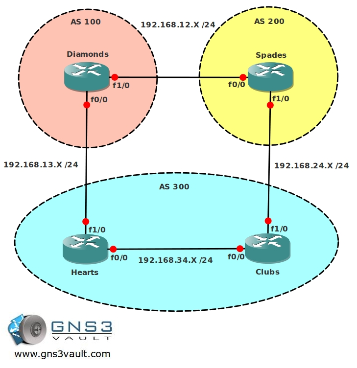

# BGP Backdoor

## Scenario

As a professional poker player you have won the WSOP (World Series of Poker) and now your financial problems are over you decide to start your own online poker room. The bluffing is over it's time to configure your own company network...you have setup your own AS (100) and are connected to a service provider who is using AS 300. You are connecting your network to another big online poker website to exchange network information but you are using EIGRP instead of BGP to connect AS 100 and 200...the problem you face is that traffic from your AS towards AS 200 is being sent towards AS300 and not using the direct link between router Diamonds and Spades.

## Goal

- All IP addresses have been preconfigured for you.
- All routers have a loopback interface:
  - Router Diamonds: L0: 1.1.1.1 /24
  - Router Spades: L0: 2.2.2.2 /24
  - Router Hearts: L0: 3.3.3.3 /24
  - Router Clubs: L0: 4.4.4.4 /24
- Configure EBGP between AS 100 and AS 300.
- Router Diamonds: Advertise the 1.1.1.0 /24 network in BGP.
- Configure IBGP on router Hearts and Clubs.
- Configure EBGP between AS 200 and AS 300.
- Router Diamonds: advertise the 1.1.1.0 /24 network in BGP.
- Router Spades: advertise the 2.2.2.0 /24 network in BGP.
- Ensure you can ping 2.2.2.2 from router Diamonds.
- Ensure you can ping 1.1.1.1 from router Spades.
- If you have any connectivity problems fix them by using next-hop-self or advertising the appropriate networks in BGP. Do not advertise the 192.168.12.X /24 network in any way.
- Configure EIGRP between router Diamonds and Spades:
  - Advertise the 192.168.12.0 /24 network.
  - Advertise the 1.1.1.0 /24 network.
  - Advertise the 2.2.2.0 /24 network.
  - Disable auto-summary
- Ensure you have an EIGRP neighbor relationship between the 2 routers.
- Do a traceroute from router Spades to 1.1.1.1, which path is it taking?
- Use a BGP command to make sure that traffic from router Spades towards 1.1.1.1 is using the 192.168.12.X link and is not being sent through AS 300.
- When the link between router Diamonds and Spades fails it should use AS 300 to reach the 1.1.1.0 /24 network.

---

## IOS

- c3640-jk9s-mz.124-16.bin

## Topology

## Video Solution

[http://www.youtube.com/watch?v=1ibXygbrdes](http://www.youtube.com/watch?v=1ibXygbrdes)
