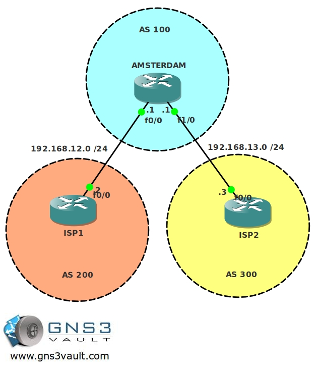

# BGP Basic

## Scenario

You are responsible for the Internet connection of a company called "Wooden Shoe Corp". Their main site is located in Amsterdam and is currently connected with a single connection to an ISP. Because the Internet connection is critical to the company, you decided to become multi-homed by connecting to another provider. To connect to both providers and be ready for the future you decide to implement BGP.

## Goal

- All IP addresses have been preconfigured for you.
- Configure BGP on all routers, use the Autonomous System (AS) numbers as specified in the topology picture.
- The ISP routers have the following loopbacks:
  - ISP1 Loopback0: 2.2.2.2 /24
  - ISP2 Loopback0: 3.3.3.3 /28
- Advertise these loopbacks in BGP and ensure you have reachability from the Amsterdam router.
- Achieve full connectivity, only use BGP to achieve this.

## Additional Information

## IOS

- c3640-jk9s-mz.124-16.bin

## Topology

## Video Solution

- [BGP Basic - Video Solution](http://www.youtube.com/watch?v=vJUdum9Fdeo)
