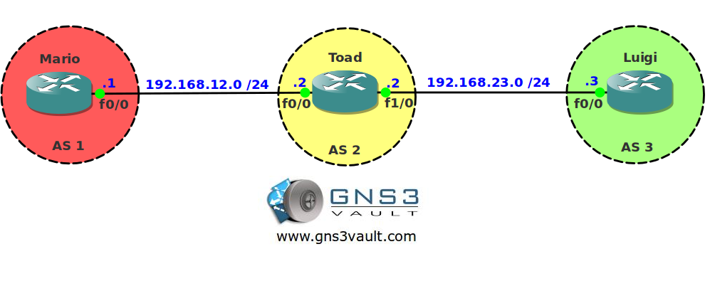

# BGP Communities Delete and Additive

## Scenario

Mushroom Kingdom is stronger than ever before. Some of the citizens have switched their career to become network engineers specializing themselves in BGP. One of the moustached network engineers is sending some communities values along with prefixes but you want to change this slightly.

## Goal

- All IP addresses have been preconfigured for you.
- Configure EBGP between AS 1 and AS 2.
- Configure EBGP between AS 2 and AS 3.
- Advertise the loopback0 interface on router Mario in BGP.
- Configure router Mario so it sends community value 100:100, 200:200 and 300:300 along with the update.
- Configure router Luigi to remove community value 200:200 and add 400:400 instead.

## IOS

c3640-jk9s-mz.124-16.bin

## Topology

## Video Solution

http://www.youtube.com/watch?v=MvYUKty1lCM
