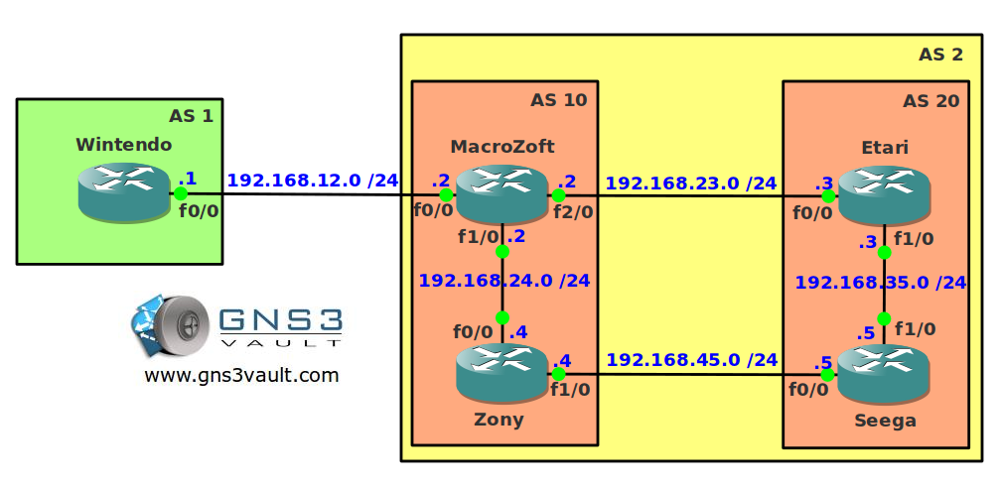

# BGP Communities Local-AS

## Scenario

The company you work for is a large game console development company. They have a large international network and you are responsible for the BGP configuration. One of the ASes is so large that you decided to implement confederations. For security reasons you need to make sure not all prefixes are advertised to all routers within AS 2.

## Goal

- All IP addresses have been preconfigured for you.
- Configure AS 2 with the federations AS 10 and AS 20.
- Configure EBGP between AS 1 and AS 2.
- Advertise the loopback0 interface on router Wintendo in BGP.
- Ensure network 1.1.1.0 /24 only shows up in sub-AS 10. Use the correct community to achieve this.

## IOS

c3640-jk9s-mz.124-16.bin

## Topology

## Video Solution

[BGP Communities Local-AS Video Solution](http://www.youtube.com/watch?v=h0vr2yp2stA)
