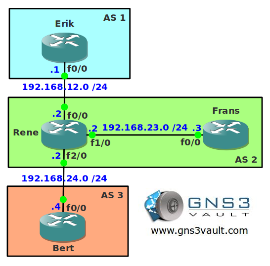

# BGP Communities No-Advertise

## Scenario

As the owner of a small dutch ISP you like to configure some of the networking stuff yourself. For one of your customers you have to make some changes to the network. They want to advertise their networks to you but you want to prevent this information to be spread to other customers or other parts within your network.

## Goal

* All IP addresses have been preconfigured for you.
* Configure EBGP between AS 1 and AS 2.
* Configure EBGP between AS 2 and AS 3.
* Configure IBGP in AS 2.
* Advertise the loopback0 interface on router Erik in BGP.
* Configure router Rene so it doesn't advertise network 1.1.1.0 /24 to any other BGP neighbor. Use one of the communities to achieve this.

## IOS

c3640-jk9s-mz.124-16.bin

## Topology

## Video Solution

[BGP Communities No-Advertise Solution](http://www.youtube.com/watch?v=XPjCSiNxKE0)
