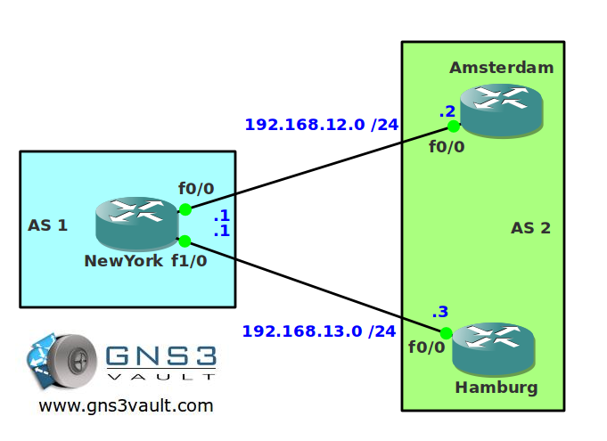

# BGP Communities

## Scenario

You are working on a small network of a ISP located in Germany. One of your colleagues is sending you prefixes tagged with communities. He's telling you to match on those communities and change your routing policy based on them. You have no idea what he's talking about but you are sure you can fix it!

## Goal

- All IP addresses have been preconfigured for you.
- Configure EBGP between router NewYork and Amsterdam.
- Configure EBGP between router NewYork and Hamburg.
- Advertise the loopback0 interface on router Amsterdam and Hamburg.
- Configure router Hamburg to send the community value 100:100 for network 23.23.23.0 /24.
- Configure router NewYork to match on the community value and send traffic for 23.23.23.0 /24 to router Hamburg.

## IOS

c3640-jk9s-mz.124-16.bin

## Topology

## Video Solution

http://www.youtube.com/watch?v=3mHvIqeNtuQ
