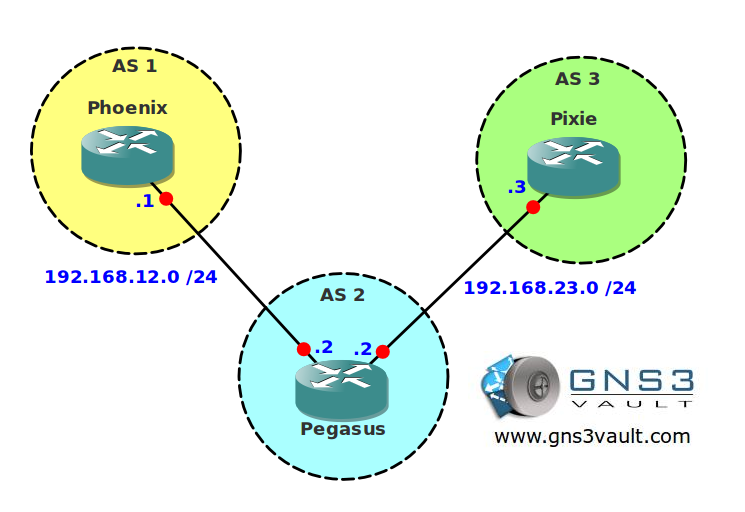

# BGP Conditional Advertisement

## Scenario

An international toy store company needs your help. They use BGP to exchange routing information between their sites but everytime one of their IBGP routers fails they have connectivity issues. Let's see if you can help them out!

## Goal

* All IP addresses have been preconfigured for you.
* Configure EBGP between AS 1 and AS 2.
* Configure EBGP between AS 2 and AS 3.
* Configure router Pegasus to advertise network 2.2.2.0 /24 in BGP.
* Configure router Phoenix to advertise network 1.1.1.0 /24 in BGP.
* Configure router Pegasus so it does no longer advertise network 2.2.2.0 /24 when network 1.1.1.0 /24 is no longer reachable.

## IOS

c3640-jk9s-mz.124-16.bin

## Topology

## Video Solution

http://www.youtube.com/watch?v=lqpTUHu3j9o
