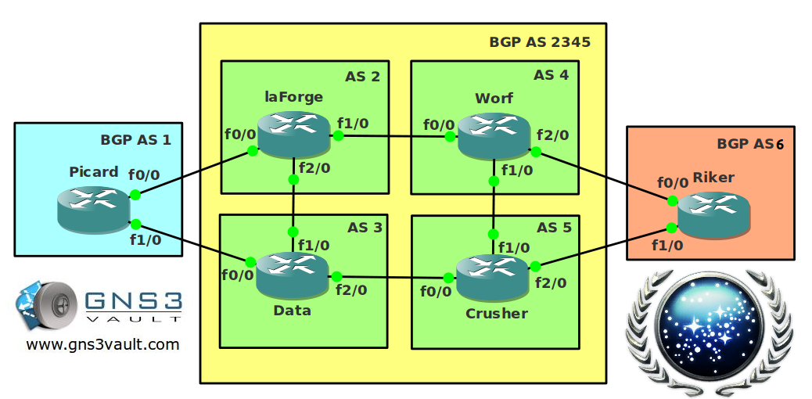

# BGP Confederations

## Scenario

You are the senior network engineer working for the federation of planets. BGP was developed on earth but is heavily used between planets as well. The network is expected to grow and to make you don't go crazy over configuring full mesh IBGP peerings you want to use a solution that is scalable for the future. You already know how to configure route reflectors and clusters but you haven't seen BGP confederations yet. Let's see if you can configure this.

## Goal

- All IP addresses have been preconfigured for you. I'm not showing them in the topology picture or it will be a big mess.
- Each router has a loopback0 interface.
- Configure OSPF within AS 2345 so the routers know how to reach each others loopback interfaces.
- Configure IBGP within AS 2345 but create confederations, use AS2, AS3, AS4 and AS 5.
- Configure EBGP between AS 1 and AS 2345.
- Configure EBGP between AS 2 and AS 2345.
- Advertise all loopback0 interfaces in BGP.
- Ensure all loopback0 interfaces are reachable throughout the BGP network.

## IOS

c3640-jk9s-mz.124-16.bin

## Topology

## Video Solution

http://www.youtube.com/watch?v=y1v_haNIM-w
