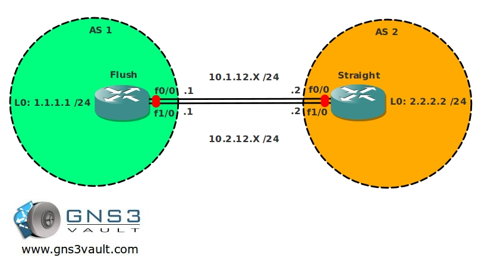

# BGP Disable Connected Check

## Scenario

You are a big poker fan and also a master in networking. Your favorite online poker room has been experiencing connection problems and you decided to help them out. They added another link to the service provider for extra redundancy, now the only thing left to do is making sure the BGP configuration is also correct...can you go all-in on this one?

## Goal

- All IP addresses have been preconfigured as specified in the topology picture.
- Create 2 static routes pointing to each others loopback interface:
  - For the 10.1.12.X link use an administrative distance of 10.
  - For the 10.2.12.X link use an administrative distance of 20.
- Ensure you can ping every IP address.
- Configure EBGP and use the correct AS numbers, the updates must be sourced from the loopback interfaces.
- You are not allowed to use EBGP Multihop to solve this problem.

## IOS

- c3640-jk9s-mz.124-16.bin

## Topology

## Video Solution

[Watch on YouTube](http://www.youtube.com/watch?v=vWC33cuf9y4)
