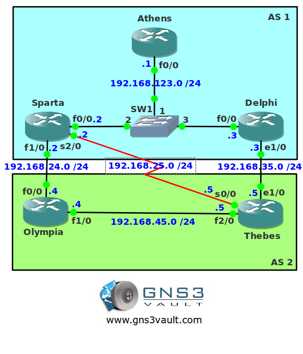

# BGP DMZ Link Bandwidth

## Scenario

You work for a greek ISP where you are known as "The Greek Wonder". You solve routing problems faster than Zeus could shoot lightning bolts. One part of the network uses BGP and there are multiple links between AS 1 and AS 2. Not all links have the same bandwidth but you would like to use all of them. You just read about the Link Bandwidth feature for BGP and you are looking forward to implementing it.

## Goal

- All IP addresses have been preconfigured for you.
- Configure IBGP within AS 1. Use the loopback0 interfaces to source the BGP updates from.
- Configure IBGP within AS 2. Use the loopback0 interfaces to source the BGP updates from.
- Configure EBGP between AS 1 and AS 2.
- Ensure traffic from router Athens is load balanced proportionally over all available links.

## IOS

c3640-jk9s-mz.124-16.bin

## Topology

## Video Solution

[Video Solution on YouTube](http://www.youtube.com/watch?v=fsrANHom7zo)
