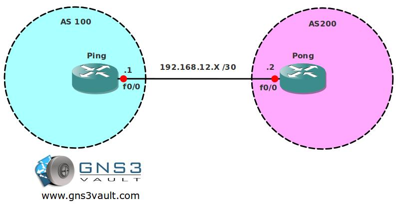

# BGP EBGP Multihop

## Scenario

You are the junior network engineer for the biggest company in the world selling Arcade Games. You need to establish a BGP link with the service provider. In the future they will add another physical link for redundancy, so the provider wants you to setup the EBGP link between the loopback adapters for logical redundancy...time for some practice!

## Goal

- All IP addresses have been preconfigured for you as specified in the topology picture.
- Both routers have a loopback interface:
  - Router Ping: L0: 1.1.1.1 /32
  - Router Pong: L0: 2.2.2.2 /32
- Configure static routes on both sides pointing to each others loopback.
- Ensure you have full reachability and can ping both loopbacks.
- Router Ping: configure BGP AS 100
- Router Pong: configure BGP AS 200
- Establish a BGP neighbor relationship between the 2 routers. You need to source the BGP updates from the loopback interfaces.
- Ensure you have a BGP neighbor relationship, use the "show ip bgp summary" command to confirm this.

## Additional Information

## IOS

- c3640-jk9s-mz.124-16.bin

## Topology

## Video Solution

[YouTube - BGP EBGP Multihop Solution](http://www.youtube.com/watch?v=kMum9IrIpdw)
