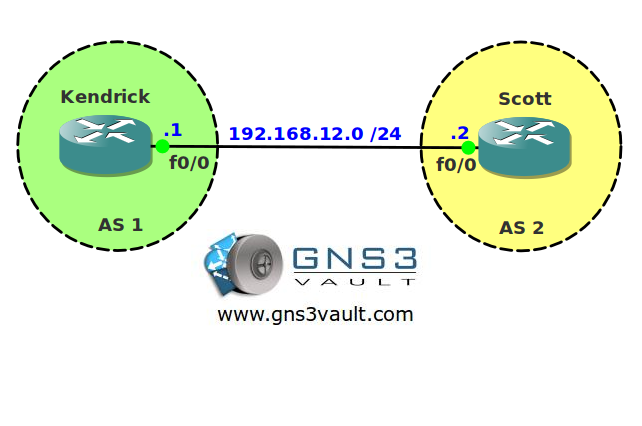

# BGP Fast Fallover

## Scenario

Kendrick and Scott are using BGP to exchange routing information. Unfortunately the link that connects both routers isn't that reliable. Everytime it goes down it also tears down the BGP peering...let's see if you can prevent that!

## Goal

- All IP addresses have been preconfigured for you.
- Configure EBGP on router Kendrick and use AS number 1.
- Configure EBGP on router Scott and use AS number 2.
- Ensure that whenever the physical interface fails the BGP peering only drops when the holddown timer expires.

## IOS

c3640-jk9s-mz.124-16.bin

## Topology

## Video Solution

http://www.youtube.com/watch?v=zQKjRrcx8GQ
