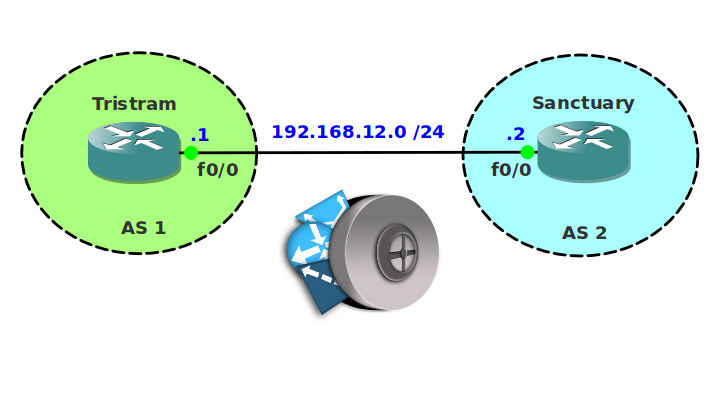

# BGP Filtering Extended Access-List

## Scenario

Ever since Diablo was defeated Deckard Cain decided to become a network engineer. Two decades have passed and the village of Tristram has upgraded their network for inter-AS connectivity. Recently some security issues have been reported and Deckard asked you to help him to filter some of the prefixes through BGP. Unfortunately the router does not support prefix-lists so you'll have to use access-lists to accomplish this.

## Goal

* All IP addresses have been preconfigured for you.
* Advertise the loopback interfaces on both routers in BGP.
* Configure a summary that advertises 10.0.0.0/8 towards router Sanctuary.
* Configure an extended access-list on router Sanctuary that will block the 10.0.0.0/8 prefix but allows all other prefixes.
* Configure an extended access-list on router Tristram that blocks network 10.2.2.0/24.

## IOS

c3640-jk9s-mz.124-16.bin

## Topology

## Additional Resources
