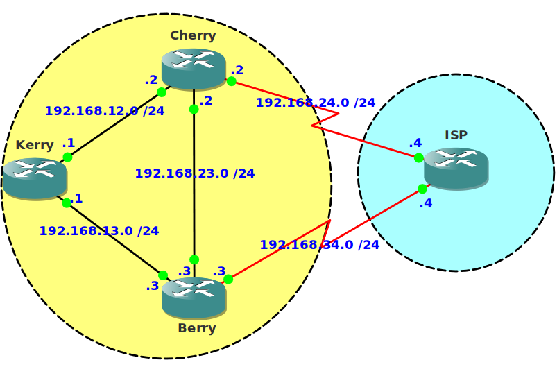

# BGP IBGP/EBGP Local Preference MED

## Scenario:

You are working for a company specialized in selling vegetables and fruit and responsible for the whole network. To reduce the risk of losing the connection to the Internet you decided to get another link to your ISP. The first link between Cherry and ISP is an expensive link where you have to pay for every megabyte that is transfered, this link should only be used for backup. The second link between Berry and ISP is cheap and up 24/7. All traffic should be sent using this link.

## Goal:

- All IP addresses are preconfigured as specified in the topology picture.
- Every router has a loopback interface:
  - Kerry: Loopback0: 1.1.1.1 /24
  - Cherry: Loopback0: 2.2.2.2 /24
  - Berry: Loopback0: 3.3.3.3 /24
  - ISP: Loopback0: 4.4.4.4 /24
- Configure EIGRP in AS 100.
- Do not advertise the links between AS100 and AS200 in EIGRP.
- Configure IBGP within AS100, the source of BGP updates has to be the loopback interface.
- Configure EBGP between router Cherry and ISP.
- Configure EBGP between router Berry and ISP.
- Advertise the loopback interfaces into BGP, do this on all routers.
- Ensure you have full reachability to all networks.
- Do a traceroute from router ISP to the 1.1.1.0 network. Which path does it take? Do you know why this path was preferred over the other?
- You need to make sure that all traffic for AS100 is being sent using the link between router Berry and ISP. You are only allowed to make changes on router Berry or Cherry. (hint: use MED)
- To conform to the company policy, you need to make sure that all outgoing traffic will be sent using the link between router Berry and ISP. (hint: use Local Preference)
- Optional: change the BGP setup between Cherry and ISP so the BGP updates are sourced from the loopback interfaces.

## IOS:

c3640-jk9s-mz.124-16.bin

## Topology:

## Video Solution:

[YouTube Video](http://www.youtube.com/watch?v=PbjNJK13ZZ8)
