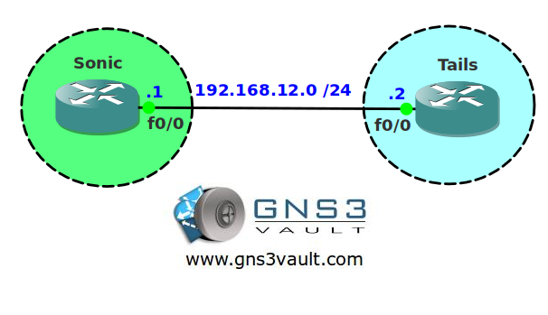

# BGP Local AS

## Scenario

The local hedgehog protection foundation is merging with the local Fox protection program. The networks are connected through BGP and part of the migration means you have to change your AS number. You don't mind doing this but you don't want to break the BGP neighbor adjacency.

## Goal

* All IP addresses have been preconfigured for you.
* Configure EBGP on router Sonic and use AS number 1.
* Configure EBGP on router Tails and use AS number 2.
* You have to configure router Tails with the "neighbor remote-as 100" command.
* Ensure your EBGP configuration is working.

## IOS

c3640-jk9s-mz.124-16.bin

## Topology

## Video Solution

[BGP Local AS Video Solution](http://www.youtube.com/watch?v=mY_sYY1GwfI)
