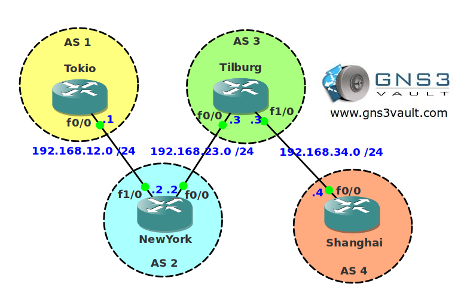

# BGP Max AS Limit

## Scenario

AsianFish inc. is expanding their business towards Europe so they need to expand their network as well. BGP has been configured for inter-AS connectivity but you want to make sure you don't receive just any prefix on the Internet. Business has been fishy lately so there's no budget for routers with enough memory to carry all the BGP prefixes. To make sure your routers keep running you only want to accept prefixes from a number of autonomous systems.

## Goal

* All IP addresses have been preconfigured for you.
* Configure EBGP between AS 1 - 2, AS 2 - 3 and AS 3 - 4.
* Advertise the loopback0 interfaces of all routers in BGP.
* Configure router Tilburg so it only allows prefixes from directly connected autonomous systems.
* You are not allowed to use as path filtering or any regular expressions.

## IOS

c3640-jk9s-mz.124-16.bin

## Topology

## Video Solution

http://www.youtube.com/watch?v=dE2asMqoM7o
