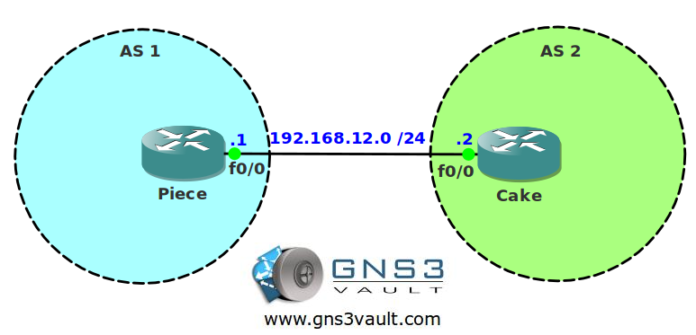

# BGP MD5 Authentication

## Scenario

You are working for a networking site and responsible for creating labs. After a day of working on BGP labs you notice you don't have any lab on MD5 authentication. BGP authentication is one of the features that is not too spectacular but you need to write an article to show other network gurus how it works...let's see if you can do it!

## Goal

- All IP addresses have been preconfigured for you as specified in the topology picture.
- Configure EBGP between AS 1 and AS 2.
- Configure MD5 authentication between router Piece and Cake.

## IOS Image

- c3640-jk9o3s-mz.124-16.bin

## Topology

## Video Solution

[BGP MD5 Authentication Lab Video](http://www.youtube.com/watch?v=hgO6zX6lCTg)
