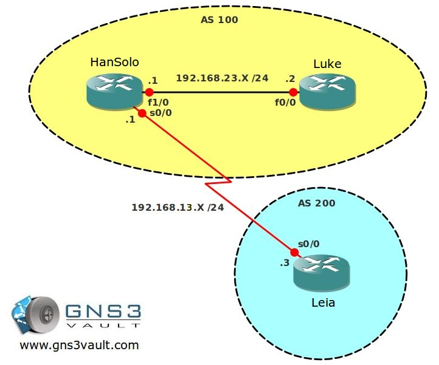

# BGP Next-Hop Self Manual

## Scenario

As a junior networking engineer you were always fascinated with science fiction movies, that's why you are now working at a company specialized in special effects. The closest you got to light speed was sending bits and bytes with electricity through wires...nevertheless there is a task waiting for you. You need to configure BGP between your network (AS100) and the service provider (AS100). Setting up BGP was no problem for you, but users behind router Luke are complaining they can't access networks in AS 200. Time for you to solve this problem...you feel the force is strong within you so this should be a piece of cake!

## Goal

- All IP addresses have been preconfigured as specified in the topology picture.
- Configure IBGP between router Hansolo and Luke, use AS 100, use the loopback0 interfaces as source for BGP.
- Configure EBGP between router Hansolo and Leia.
- Ensure both BGP neighbor relationships are up.
- Router HanSolo: Advertise the 192.168.12.0/24 network into BGP.
- Router Leia: Advertise the 3.3.3.0 /24 network on the loopback0 interface into BGP.
- Router Leia: Advertise the 33.33.33.0 /24 network on the loopback1 into BGP.
- Ensure you can ping this network from router Hansolo.
- Ensure you can ping the loopback0 and loopback1 interface of router Leia from router Luke. You are not allowed to use static routes, don't advertise network 192.168.13.0 /24 in BGP and you are also not allowed to use the BGP next-hop self command.

## IOS

c3640-jk9s-mz.124-16.bin

## Topology

## Video Solution

http://www.youtube.com/watch?v=uviYdF1Z3P0
