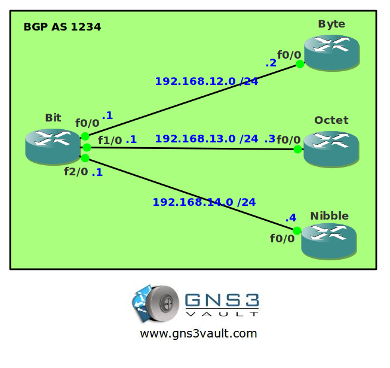

# BGP Peer Group

## Scenario

Your autonomous system has a lot of IBGP routers. You are already familiar with route reflectors which saves you a lot of trouble configuring all the IBGP neighbor peerings. You just read about BGP peer groups which sounds very interesting. Less CPU overhead and even less configuration for you. Let's see if this will work.

## Goal

- All IP addresses have been preconfigured for you as specified in the topology picture.
- Configure a peer group called "PEERS" on router Bit.
- Router Byte, Octet and Nibble should only form IBGP peerings with router Bit.
- Ensure you have full connectivity within AS 1234.

## IOS

c3640-jk9o3s-mz.124-16.bin

## Topology

## Video Solution

[http://www.youtube.com/watch?v=qiRlhR_Q1uU](http://www.youtube.com/watch?v=qiRlhR_Q1uU)
