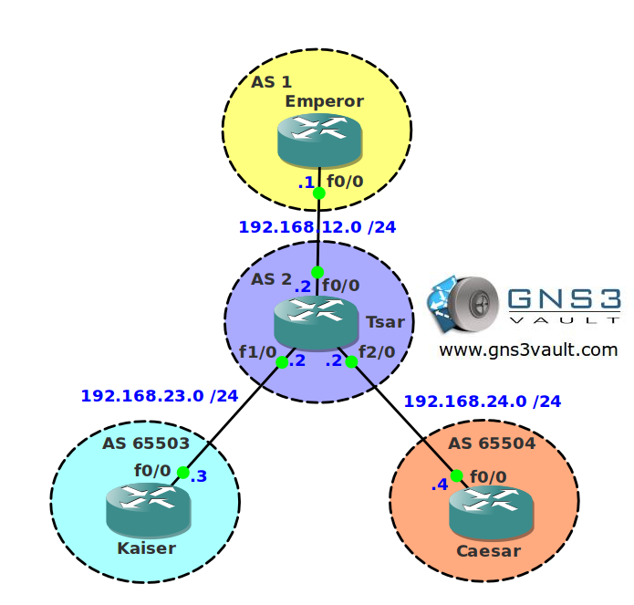

# BGP Remove Private AS

## Scenario

The imperial museum corporation has many museums around the world. All networks are connected and BGP is used as the routing protocol. One of the autonomous systems is a transit AS and has two autonomous systems behind it with private AS numbers. You want to ensure that nobody sees those private AS numbers without having trouble with reachability.

## Goal

- All IP addresses have been preconfigured for you.
- Configure EBGP between AS 1 and AS 2.
- Configure EBGP between AS 2 and AS 65503.
- Configure EBGP between AS 2 and AS 65504.
- Advertise the loopback0 interfaces on router Kaiser and Caesar.
- Ensure AS 1 doesn't see the private AS numbers but has connectivity to network 3.3.3.0 /24 and 4.4.4.0 /24.

## IOS

c3640-jk9s-mz.124-16.bin

## Topology

## Video Solution

[BGP Remove Private AS Video Solution](http://www.youtube.com/watch?v=Z0wkiGxfgsI)
