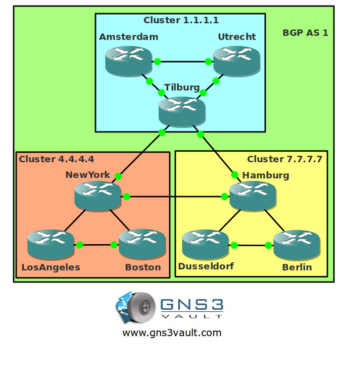

# BGP Route Reflectors and Clusters

## Scenario

As the senior network engineer for a large international company you are always trying to optimize your network and get the most out of your time. The network has a lot of IBGP routers and you got sick of configuring all those neighbor peerings. To fix this you configured the network with some route reflectors...this has saved you a lot of work but you want to take it one step further by clustering the network.

## Goal

* All IP addresses have been preconfigured for you. You don't see them in the topology picture or it would look like a picasso painting.
* Each router has a loopback0 interface.
* All routers belong to AS 1.
* Configure router Tilburg as the route-reflector for router Amsterdam and Utrecht. Use cluster-ID 1.1.1.1.
* Configure router NewYork as the route-reflector for router LosAngeles and Boston. Use cluster-ID 4.4.4.4.
* Configure router Hamburg as the route-reflector for router Dusseldorf and Berlin. Use cluster-ID 7.7.7.7
* Configure router Tilburg, Newyork and Hamburg with the correct IBGP neighbor peerings.
* Advertise all loopback0 interfaces in BGP.
* Ensure you have full reachability within AS 1. All loopback0 interfaces should be reachable.

## IOS

c3640-jk9o3s-mz.124-16.bin

## Topology

## Video Solution

[BGP Route Reflectors and Clusters Video Solution](http://www.youtube.com/watch?v=Naq0v_cKSIM)
