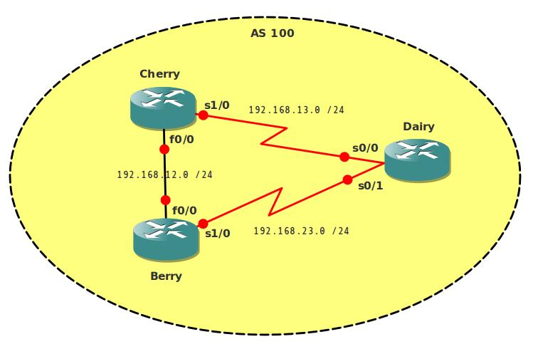

# BGP Route Reflectors

## Scenario

Company Veggie inc. is growing rapidly and the network needs to support the growing company. More routers are added every week and network engineers are complaining it takes too much time to setup BGP. Especially typing in all the neighbor commands is becoming an annoyance for them. Time for you to show up and teach them what a route-reflector is!

## Goal

- All IP addresses have been preconfigured as specified in the topology picture.
- All routers have the following loopback interface:
  - Cherry: Loopback0: 1.1.1.1 /24
  - Berry: Loopback0: 2.2.2.2 /24
  - Dairy: Loopback0: 3.3.3.3 /24
- Configure OSPF on all routers, ensure you have full reachability.
- Disable the link between Cherry and Berry.
- Configure BGP between Cherry and Dairy.
- Configure BGP between Berry and Dairy.
- Do not configure BGP between Berry and Cherry.
- Create a new loopback interface on router Berry:
  - Loopback1: 22.22.22.22 /24
- Advertise this loopback into BGP by using a network command.
- Ensure you see 22.22.22.0 network in the routing table of router Dairy.
- Do you see this network in the routing table of router Cherry? Why not?
- Change the configuration on router Dairy so that router Cherry will have the 22.22.22.0 network in it's routing table (hint: *Route Reflector*).

## IOS

c3640-jk9s-mz.124-16.bin

## Topology

## Video Solution

http://www.youtube.com/watch?v=K39KAX1zNzQ
