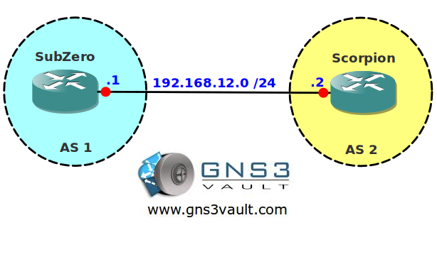

# BGP Soft Reconfiguration

## Scenario

You are a network engineer responsible for the network for a local fighting tournament. Two of the fighters exchange tactics using BGP to advertise the networks. They don't want to exchange everything they know so they are a number of inbound route filters. You want to make sure the new filters are applied without resetting the BGP peering...get over here!

## Goal

- All IP addresses have been preconfigured for you.
- Configure EBGP between AS1 and AS2.
- Advertise network 2.2.2.0 /24 on router Scorpion in BGP.
- Configure a prefix-list on router SubZero that filters network 2.2.2.0 /24 and apply it to neighbor router Scorpion.
- Ensure the changes are visible without resetting the BGP peering.

## IOS

c3640-jk9s-mz.124-16.bin

## Topology

## Video Solution

[BGP Soft Reconfiguration Video Solution](http://www.youtube.com/watch?v=OfsDApMIfhA)
