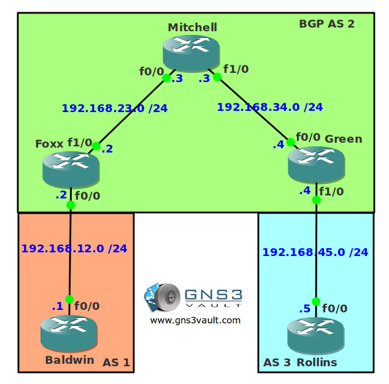

# BGP Synchronization

## Scenario

You are a freelance network consultant specialized in solving BGP problems. One of your customers, a small ISP has trouble with customers that are unable to reach each other. They use BGP synchronization on some of their routers.

## Goal

* All IP addresses have been preconfigured as specified in the topology picture.
* Each router has a loopback0 interface.
* Configure OSPF within AS 2 to advertise the loopback0 interfaces. Don't advertise or run OSPF on the links interconnecting AS 1 and AS 3.
* Configure IBGP between router Foxx and Green. Source the BGP updates from the loopback0 interfaces.
* Enable BGP synchronization.
* Configure EBGP between router Foxx and Baldwin.
* Configure EBGP between router Green and Rollins.
* Advertise the loopback0 interfaces on router Baldwin and Rollins.
* Ensure AS 1 and AS 3 can communicate with each other without removing the BGP synchronization command.

## IOS

c3640-jk9s-mz.124-16.bin

## Topology

## Video Solution

[Video: BGP Synchronization Lab Solution](http://www.youtube.com/watch?v=NVKfIZEncwk)
