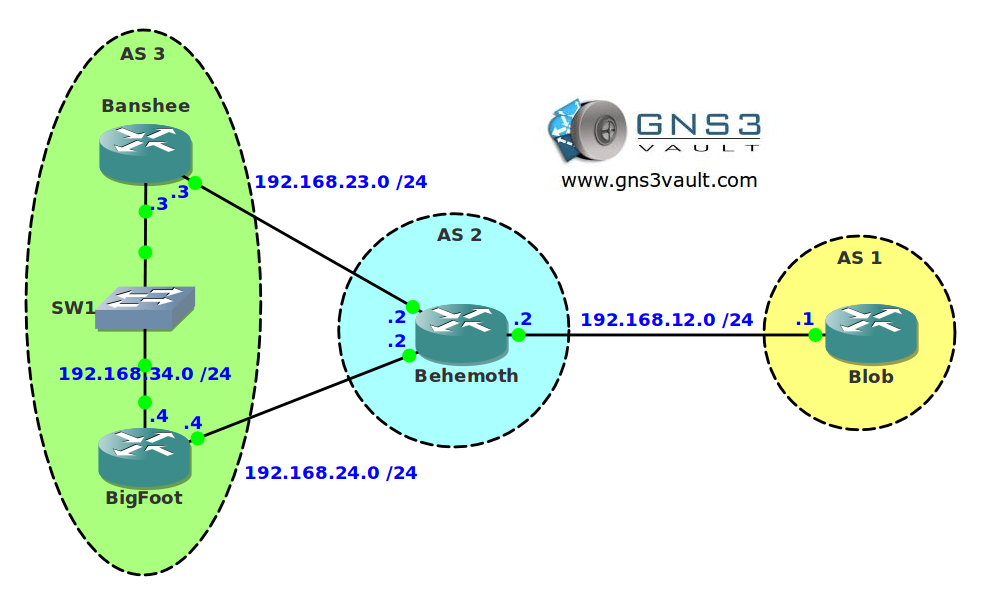

# BGP Traffic Engineering Unsuppress-Map

## Scenario

The mystical creature corporation has a large international network of fantasy enthusiastics people sharing new mystical rumors. They are running BGP to exchange routing information between each other. At some point in the network you are aggregating a number of prefixes but a downside of this that you are unable to use traffic engineering. Let's see what solution you can come up with.

## Goal

- All IP addresses have been preconfigured for you.
- Configure IBGP within AS 3.
- Configure EBGP between AS 2 and AS 3.
- Configure EBGP between AS 1 and AS 2.
- Configure router Blob to advertise all loopback interfaces in BGP.
- Configure BGP aggregation on router Behemoth to summarize the loopback interfaces in the most optimal summary towards AS 3.
- Configure the network so AS 3 sends traffic to network 172.16.0.0 /24 through router Banshee.
- Configure the network so AS 3 sends traffic to network 172.16.1.0 /24 through router BigFoot.
- You are not allowed to use static, default routes or any IGP. Do not remove the summary on router Behemoth.
- You are not allowed to use any BGP communities or attributes.

## IOS

c3640-jk9s-mz.124-16.bin

## Topology

## Video Solution

[YouTube Video: BGP Traffic Engineering Unsuppress Map](http://www.youtube.com/watch?v=T9A_tP2vlVg)
