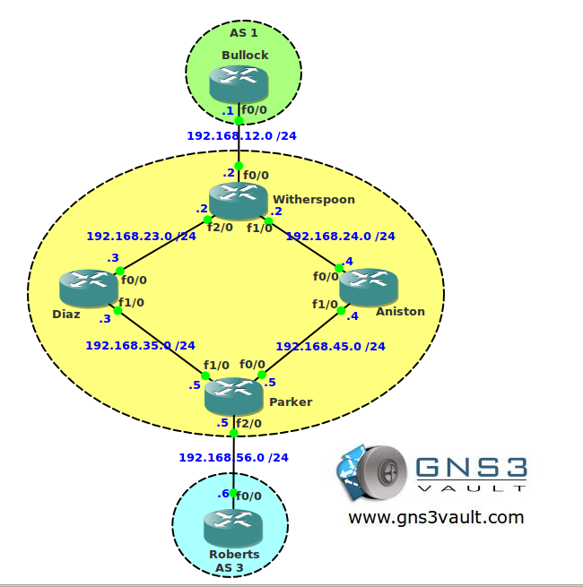

# BGP Transit AS

## Scenario

Tillywood is one of the major movie studios located in Tilburg, The Netherlands. You are working there as a junior network engineer and assigned at the BGP team. One of the trainees has configured part of the network which has a transit AS but he has trouble sending packets between AS 1 and AS 3. Can you show him how it's done?

## Goal

- All IP addresses have been preconfigured for you as specified in the topology picture.
- Configure EBGP between AS 1 and AS 2.
- Configure EBGP between AS 2 and AS 3.
- Configure IBGP within AS 2.
- Ensure AS 1 and AS 3 can reach each others loopback interfaces.

## IOS

c3640-jk9o3s-mz.124-16.bin

## Topology

## Video Solution

http://www.youtube.com/watch?v=kSsEDpd40uI
