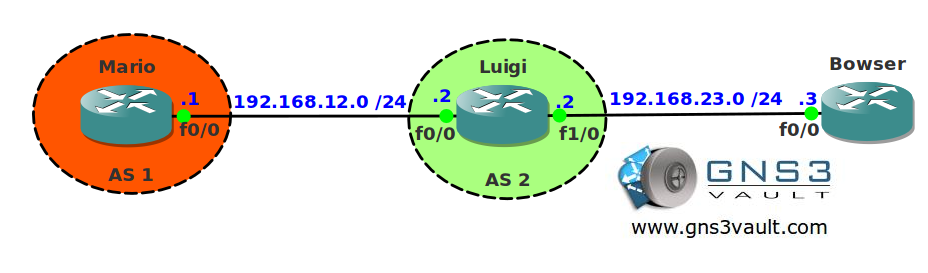

# BGP TTL Security

## Scenario

After years of plumbing work you switched your career to become a network engineer. Besides being good at routing & switching you are very security-minded. One of your routers is connected to your brother's network and you use BGP to exchange routing information. You want to make sure hackers are unable to spoof the BGP peering in any way.

## Goal

- All IP addresses have been preconfigured for you.
- Configure EBGP between router Mario and Luigi.
- Ensure router Bowser can't spoof BGP packets by changing the TTL on router Mario for BGP.

## IOS

c3640-jk9s-mz.124-16.bin

## Topology

## Video Solution

http://www.youtube.com/watch?v=YiuzLFEQZY4
