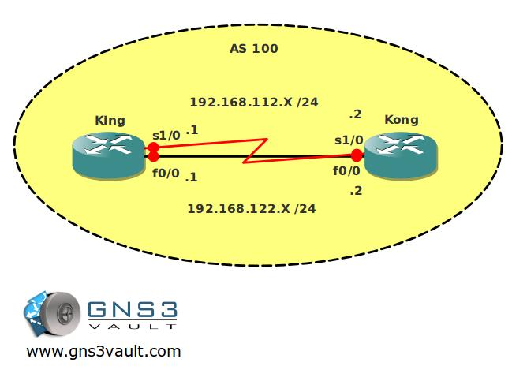

# BGP Update Source

## Scenario

As the senior network engineer of an international fruit-selling company you need to configure IBGP within the network. Since your manager wants no SPOF (single point of failure) you decide to add another link between the routers, now the only thing left to do is make sure the logical configuration is also redundant...back to work!

## Goal

* All IP addresses have been preconfigured for you.
* Both routers have a loopback interface:
  * Router King: L0: 1.1.1.1 /32
  * Router Kong: L0: 2.2.2.2 /32
* Configure EIGRP AS 100 on both routers, advertise all networks.
* Ensure you have full reachability and can ping both loopbacks.
* Configure BGP AS 100 on both routers, do not advertise any networks.
* Make sure that whenever a single link goes down, the BGP neighbor relationship will not reset itself.
* Try this by first shutting down the FastEthernet link, bring it back up and then try the serial link.

## Background

## IOS

* c3640-jk9s-mz.124-16.bin

## Topology

You need to register to be able to download the GNS3 Topology File. (Registration is Free!)

## Video Solution

[View Video Solution on YouTube](http://www.youtube.com/watch?v=kVY8_250Up8)
