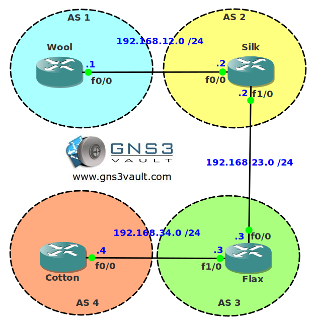

# EBGP - External BGP

## Scenario

Textilalicious is a large international company specialized in selling Wool, Silk, Cotton and Flax. Each region is specialized in selling a different type of textile. To support the growth of the company network your boss has decided to use BGP to connect the different regions together. You just finished studying BGP for your CCNP ROUTE exam so your boss agrees to let you configure this network.

## Goal

- All IP addresses have been preconfigured for you as specified in the topology picture.
- Configure EBGP between AS 1 and AS 2.
- Configure EBGP between AS 2 and AS 3. You are not allowed to use the IP addresses on the physical interfaces to configure the BGP neighbor adjacency.
- Configure EBGP between AS 3 and AS 4.
- Advertise the loopback interfaces in BGP and ensure you have full reachability for this network.

## IOS

c3640-jk9o3s-mz.124-16.bin

## Topology

## Video Solution

http://www.youtube.com/watch?v=D0o-cdhiwjs
