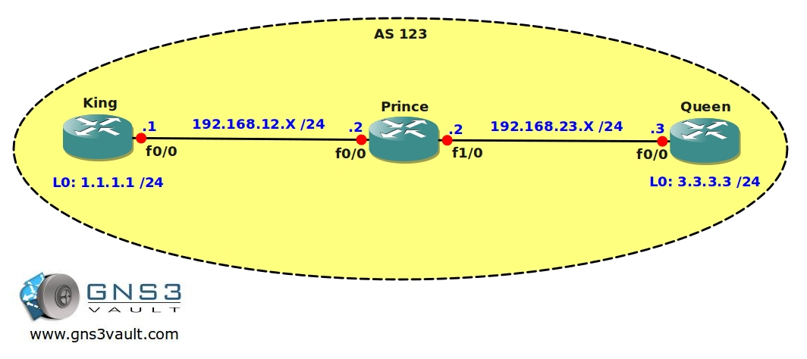

# BGP IBGP Blackhole Routing

## Scenario

You are applying for a new job at a Dutch networking company specialised in routing & switching solutions. One of the senior networking engineers decides to take you up the test and see what your skills are like. He shows you an IBGP problem where traffic is being blackholed...time for you to show him a trick or two.

## Goal

- IP addresses have been preconfigured as specified in the topology picture.
- Configure IBGP AS 123 on router King and Queen, use the physical interfaces.
- The senior network engineer has prohibited you from making any changes to router Prince.
- Advertise the loopback0 interfaces from router King and Queen into BGP.
- You are not allowed to use static routes to reach the loopback interfaces, use IBGP to achieve this.
- Ensure you can ping each others loopback addresses from router King or Queen.

## IOS

- c3640-jk9s-mz.124-16.bin

## Topology

## Video Solution

[Video Solution on YouTube](http://www.youtube.com/watch?v=tX_mLFebwuw)
