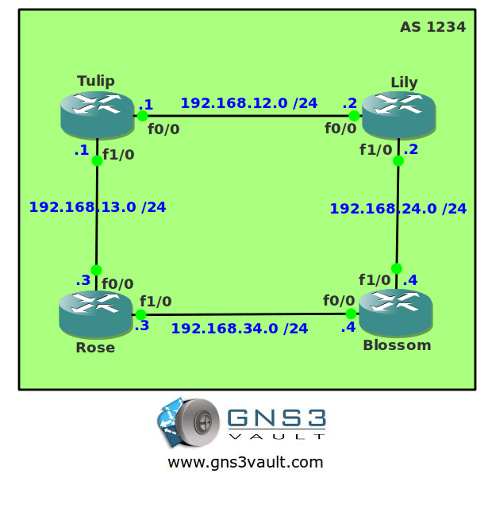

# IBGP - Internal BGP

## Scenario

Big Blooms is a fairly large retail company selling all kinds of flowers. Big Blooms has multiple sites and will use BGP in the future to connect all the different sites. Their headquarters network will be used to connect all the different networks and will be used as a transit for all the different sites. In order to prepare for the BGP configuration you have to configure IBGP (Internal BGP) for them.

## Goal

* All IP addresses have been preconfigured for you as specified in the topology picture.
* Each router has a loopback0 and loopback1 interface.
* Configure IBGP AS 1234 on all routers. You are not allowed to use IP addresses on the physical interfaces for the neighbor adjacency.
* Advertise the loopback1 interfaces in IBGP and ensure you have full connectivity within AS 1234.

## IOS

c3640-jk9o3s-mz.124-16.bin

## Topology

## Video Solution

[Video: IBGP Configuration](http://www.youtube.com/watch?v=q7Lzjqt6GLY)
