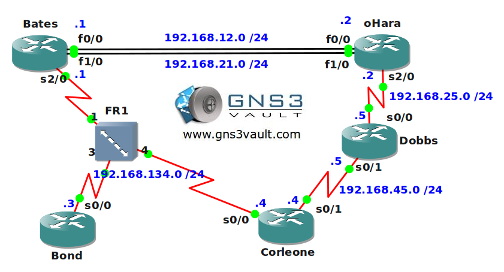

# EIGRP CCNA 1

## Scenario:

Tillywood is where all the famous blockbuster movies are created in Tilburg, The Netherlands. This year there is a convention and all big star actors will be there. Cisco is promoting the event and thus you are going to use EIGRP as the routing protocol of choice to get connectivity. Since you are close to passing your CCNA exam this should be no problem for you...get to work!

## Goal:

* All IPv4 addresses have been preconfigured for you.
* Each router has a loopback0 interface.
* Configure EIGRP AS 1 on the frame-relay network connecting router Bates, Bond and Corleone. Advertise the loopback0 interfaces.
* You notice that router Bond and Corleone do not see each others loopback interfaces in the routing table. Configure router Bates to solve this.
* Configure EIGRP AS 1 on both fastethernet links connecting router Bates and oHara.
* Change the bandwidth on the fastethernet 1/0 interfaces so only fastethernet 0/0 is used for successor routes.
* Configure EIGRP AS 1 on router Dobbs and Corleone.
* Make sure you disable auto-summary for EIGRP AS 1.
* At this point you should have full connectivity for all networks and loopback0 interfaces.
* Create a summary on interface serial0/0 of router Dobbs so it advertises 5.5.0.0 /16 with an administrative distance of 85.
* Change the EIGRP K-Values so only delay will be used as a metric.
* Ensure router Bates can use the frame-relay network as a feasible successor route to network 4.4.4.0 /24.
* Make sure you see this feasible successor route not only in the topology table but also in the routing table.
* Enable authentication between router Dobbs and Corleone. Use a keychain called "VAULT" and password "LABS".

## IOS:

c3640-jk9o3s-mz.124-16.bin

## Topology:

## Video Solution:

http://www.youtube.com/watch?v=BbZnd5PyT5I
