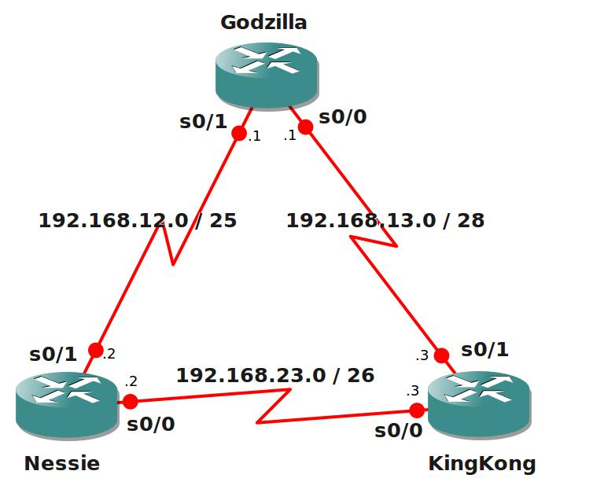

# ICND1 Assesment Lab

## Scenario:

You have been studying for the CCNA for quite some time, and you have just passed the ICND1 exam. While you continue your work towards achieving the ICND2 certificate to become fully CCNA certified you felt it was time to get a job to start your IT networking career. You apply for a job at "BigMobs inc" and the job interview went very smoothly...there is just one thing, they want you to show your newly acquired networking skills in a testlab! You are confident and willing to show your newly acquired tricks.

## Goal:

- Set all the correct hostnames on the routers.
- Set all the correct IP addresses and subnet masks, you are not allowed to use a subnet calculator.
- Godzilla: configure a type7 enable password "vault"
- Kingkong: configure a type5 enable password "vault"
- Nessie: only SSH access is allowed, no telnet. Username = big , Password = mobs
- Kingkong: configure password "cisco" on the console 0.
- The link between Godzilla and Nessie should be PPP encapsulation.
- The link between all other routers should be HDLC encapsulation.
- When you login remotely on Godzilla it should show a banner "Get away from Godzilla"
- Create a static host configuration so you can telnet to "KingKong" instead of the IP address.
- Disable automatic DNS lookups on Nessie.
- Godzilla: Make sure items sent to the console are not interrupting the command you type.
- Kingkong: the console should never timeout.
- Create a loopback1 interface on Godzilla, IP Address 1.1.1.1/24
- Create a static route on KingKong pointing to the loopback1 interface of Godzilla.
- Create a default route on Nessie pointing to the loopback1 interface of Godzilla, it should have an Administrative Distance of 200.
- Configure RIP on all routers, version2. You should be able to ping all networks.
- Make sure the subnetmask information is included with the routing updates.
- Disable CDP between KingKong and Godzilla.

## IOS:

c3640-jk9s-mz.124-16.bin

## Topology:

## Video Solution:

http://www.youtube.com/watch?v=ksy5zq43wws
