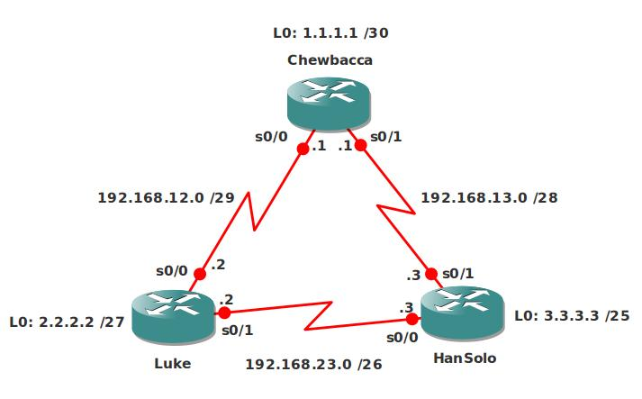

# ICND2 Assessment Lab

## Scenario

You are applying for a job at a well-known producer of science-fiction movies, one of the requisites for the job is that you have a CCNA-level of knowledge. To test you the interviewer decides to let you configure a lab and see how you will do, to make it a bit fun he also throws in some different CIDR values so you need to know your subnetting calculations...since you dream about binary numbers every day, this should be no problem...good luck!

## Goal

- All IP addresses have been preconfigured for you as specified in the topology picture.
- Configure PPP encapsulation between Router Luke and HanSolo.
- Configure PPP CHAP authentication, use password "VAULT".
- Configure OSPF on all routers, put everything in Area 0....there are limitations though:
  - Router Luke: Use a single network statement to advertise all networks including the loopback.
  - Router HanSolo: use 2 network statements to advertise all networks.
  - Router Chewbacca: use 3 network statements to advertise all networks, you are not allowed to use the 0.0.0.255 wildcard.
- Ensure you have full reachability, every IP address should be pingable.
- Manually change the Router-ID on Router HanSolo to 22.22.22.22.
- Traffic from router Hansolo to Chewbacca should use the link between router Luke and Hansolo, use "bandwidth" to accomplish this.
- Remove the previous bandwidth command, now use "cost" to accomplish the same goal.
- Configure clear-text authentication between Router Luke and Hansolo.
- Configure MD5 authentication between Router Hansolo and Chewbacca.
- Change the OSPF Hello timer on all routers so hello packets are sent every 6 seconds.
- Advertise a default route in OSPF on Router Luke, you are not allowed to create a static route.
- Optional: If you take a look at the routing table on any router, you will see that the loopback interfaces are advertised as /32's. Change this so it reflects the real subnet mask that you configured on the loopback interface.
- Configure RIP version 2 between Router Luke and Chewbacca, advertise the loopback interfaces.
- Ensure you see the RIP routes in the routing table for the 1.1.1.0 and 2.2.2.0 network, you are not allowed to make any changes to the OSPF configuration.
- When you type a "debug ip rip" on Router Luke you notice it's sending updates towards the loopback interface...this makes no sense, fix this while still advertising the 2.2.2.0 network.
- Configure EIGRP between Router Chewbacca and Hansolo, advertise the loopback interfaces as well.
- Create 2 additional loopbacks:
  - Chewbacca: Loopback1: 172.16.1.1 /24
  - HanSolo: Loopback1: 172.16.2.1 /24
- Advertise the Loopback1 interface on router HanSolo in EIGRP.
- Ping 172.16.2.1 from Router Chewbacca, make sure this ping works..otherwise check your EIGRP configuration.
- Ping 172.16.1.1 from Router Chewbacca, but this time make sure it's sourced from it's Loopback1 interface. Does this ping work or fail? Why could it be different that you are pinging from the Loopback1 interface?
- Change the configuration on Router HanSolo and Chewbacca so reliability is also used as a metric.
- Configure authentication for EIGRP:
  - key-chain: VAULT
  - key-id: 1
  - key-string: WELCOME

## IOS Image

c3640-jk9s-mz.124-16.bin

## Topology

## Video Solution

[YouTube Video Solution](http://www.youtube.com/watch?v=JIs06iW_jek)
