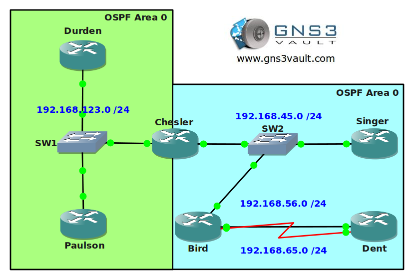

# OSPF CCNA 1

## Scenario

During the day you are working as a junior network engineer studying CCNA. During the night you are active as a respectable fighter and many of your matches are recorded on video. Some of your fans have requested your videos and you want to make sure you can deliver them over the network. You are going to configure OSPF for full connectivity...keep your fans happy, deliver the videos and study for CCNA at the same time! See if you can fight your way through this one...

## Goal

* All IPv4 addresses have been preconfigured for you.
* Each router has a loopback0 interface.
* Configure OSPF area 0 on router Durden, Paulson and Chesler. Advertise the loopback0 interfaces and make sure you have connectivity.
* Configure OSPF area 1 on router Singer, Bird and Dent. Advertise the loopback0 interfaces.
* You should now have full connectivity for your OSPF network. Make sure you can ping all interfaces including the loopback0 interfaces.
* Change the router ID of router Singer to 44.44.44.44. Make sure you can see the change by using the appropriate show command.
* Question: which router is the DR (Designated Router) and BDR (Backup Designated Router) that is connected to SW2? Can you explain why?
* Change the network so router Chesler will be the DR. Test this by resetting OSPF and using the appropriate show command.
* Enable MD5 authentication on the serial link between router Bird and Dent.
* Enable plaintext authentication on the fastethernet link between router Bird and Dent.
* Make sure all routers in area 0 send a hello packet every 4 seconds. If they don't hear anything from their neighbor after 17 seconds they should drop the neighbor adjacency.
* Advertise a default route on router Durden in OSPF. Test this by checking reachability of its loopback1 interfaces from other routers. Do not advertise the loopback1 interface in OSPF.
* Configure router Dent so it will load-balance over the serial and fastethernet link for all networks.

## IOS

c3640-jk9s-mz.124-16.bin

## Topology

## Video Solution

http://www.youtube.com/watch?v=Yzh9vh_xdFY
