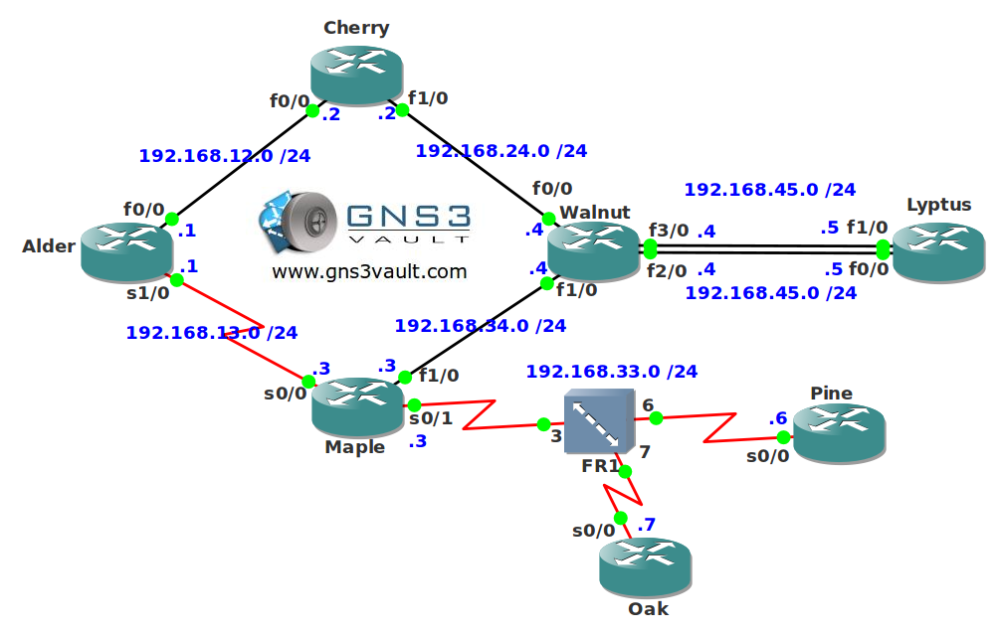

# EIGRP CCNP 1

## Scenario

Woods 'r' Us is looking for network engineers that are CCNP certified. You apply for a job as an EIGRP network engineer and instead of a job interview they ask you to configure a network so you can show them your EIGRP skills. If you successfully configure this network you are certain to get the job!

## Goal

- All IPv4 addresses have been preconfigured for you.
- Each router has a loopback0 interface.
- Configure EIGRP AS 1 on all routers. Disable auto-summary.
- Configure EIGRP so reliability is also used as a metric.
- Make sure router Alder will use the serial 1/0 interface as the primary link.
- Make sure the FastEthernet0/0 interface on router Alder is a feasible successor and visible in the routing table for unequal load-balancing.
- Router Walnut should send a summary route towards router Lyptus which only includes the loopback0 interfaces of router Alder, Cherry, Maple and Walnut. The summary route has to be as specific as possible.
- The summary route you just created should show up with an administrative distance of 51 on router Walnut.
- Ensure router Alder does not send EIGRP packets towards its loopback0 interface.
- Configure router Walnut so the loopback0 interface of router Lyptus will not be advertised towards router Cherry and Maple.
- Create a default route on router Cherry and advertise it in EIGRP.
- Ensure only one path is used between router Walnut and Lyptus without breaking the EIGRP neighbor adjacency. You are not allowed to change the metrics.
- Configure the serial interface of router Alder so EIGRP is allowed only 25% the available physical bandwidth.
- Configure authentication between router Cherry and Walnut. The key-chain should be called "GNS3VAULT" and the password is "WOOD".
- Router Lyptus shouldn't receive any query packets for lost networks.
- The serial link between router Alder and Maple will not allow multicast traffic in the future. Make the changes so the EIGRP neighbor adjacency doesn't drop when this change takes effect.
- Configure EIGRP on the frame relay network between router Maple, Pine and Oak. You have to configure EIGRP using the multipoint sub-interfaces. Advertise the loopback0 interfaces and ensure you have full reachability between the three routers.

---

## IOS

- c3640-jk9o3s-mz.124-16.bin

## Topology

