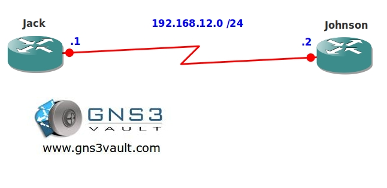

# EIGRP Authentication Rotating Key

## Scenario

As the senior security officer you decide all routing protocols should be configured as secure as possible. The company you work for has a single vendor policy and since you only have Cisco equipment you are running EIGRP (Enhanced Interior Gateway Routing Protocol). EIGRP has more advanced features for authentication since it uses a key-chain. The key-chain supports rotating keys which makes it more secure than having a single static key. Before implementing this for your whole organization you decide to test your enhanced security in a lab environment.

## Goal

* All IP addresses have been preconfigured for you.
* EIGRP has been preconfigured for you (AS12).
* Enable EIGRP authentication between router Jack and Johnson. Use the following parameters:
  * Key-chain should be called: **GNS3VAULT**
  * Key1: password **VAULT**
  * Key2: password **SAFE**
* Key1 should be sent until 9:00AM on the 2nd of February 2020 and should be accepted 15 minutes past this time.
* Key2 should be valid from 8:50AM on the 2nd of February 2020 and should be valid till the 1st of February 2021.
* Make sure routing adjacencies do not drop when the keys are switched.

## IOS

* c3640-jk9s-mz.124-16.bin

## Topology

## Video Solution

[EIGRP Authentication Rotating Key Video Solution](http://www.youtube.com/watch?v=-a2bmuoY2Qk)
