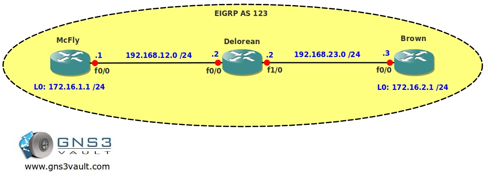

# EIGRP Auto Summarization

## Scenario

Working as a freelance network engineer you have some strange customers. One of them is a scatterbrain inventor who claims to work on a 'world-changing' machine. He has problems with his network and is currently unable to upload some schematics. The routing protocol of choice is EIGRP (Enhanced Interior Gateway Routing Protocol) and since you are an expert you should be able to fix his problems....back to the labs!

## Goal

- All IP addresses have been preconfigured for you.
- EIGRP AS123 has been preconfigured for you and is advertising all networks.
- You are not allowed to disable EIGRP auto-summarization.
- When you try to reach the networks on the loopback interfaces from router Delorean you have reachability problems, solve this problem.
- When you send a ping from router McFly's loopback0 interface to router Brown's loopback0 interface you have reachability problems, solve this problem.
- Ensure there is full reachability for all networks.

## IOS

c3640-jk9s-mz.124-16.bin

## Topology

## Video Solution

[EIGRP Auto Summarization Video Solution](http://www.youtube.com/watch?v=GGWXNQ4O5tY)
