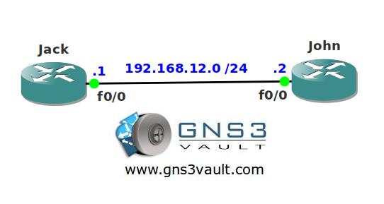

# EIGRP Debug AS number

## Scenario

One of your colleagues is on vacation and forgot to document the EIGRP topology before he left. You need to add another EIGRP router but you have no idea what the autonomous system (AS) number is of the other routers. Unfortunately you are unable to look it up but you do know that authentication is not enabled. With a bit of luck you might be able to debug your way out of this one!

## Goal

- All IP addresses have been preconfigured for you.
- EIGRP has been preconfigured for you on router John.
- Use a debug command on router Jack to retrieve the EIGRP AS number.

## IOS

c3640-jk9s-mz.124-16.bin

## Topology

## Video Solution

http://www.youtube.com/watch?v=pD91zMiF_CE
